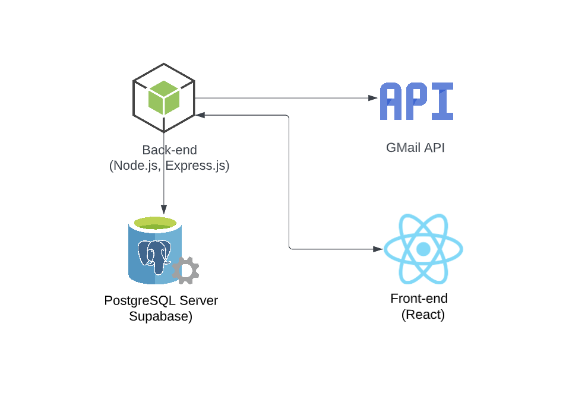

## Link -
#### https://appbuddy.tk

## Proposal

Every individual goes through the generic “job struggle” phase at least once in their life. Tracking, logging and checking every email to monitor the status of every job they have applied for. We often tend to forget to account for human error in this process. Think about a scenario wherein you might have missed a deadline or an email for an online assessment. To make this “struggle” a bit easier, we are proposing a dashboard that allows you to easily log and track the current status of all your applications at a glance and thereby, aid in an efficient and organized job search.

## Functionalities

The proposed dashboard, post the required authorization, populates a kanban board and calendar with relevant application data via Google Sheets (pre-existing or newly created) and Gmail. To summarize the functionalities, the proposed solution helps :

- Monitor emails for tracking invitation of online assessments
- Automatically populates the calendar of the user.
- Displays a Kanban board for tracking the status of all applications.
- Sends periodic reminders/notifications regarding application specific deadlines via calendar.

## Security & Privacy concerns

The dashboard will require the user to authorize access to their inbox, in order to filter the emails and retrieve relevant information/links to the application, which can be counted as a privacy concern on the user’s end.
Another concern is caused if the user’s account credentials are compromised, or if an attacker gains access to the user’s google account in any way; which will indirectly give them access to the dashboard as well.

## Architecture

### Services

Database : Supabase  
Frontend : Netlify  
Backend : Fly.io/Render  

### Tech-stack

Database : PostgreSQL  
Front-end : React  
Back-end : Node.js, Express.js  

### API

Google GMail API

## MVP(end of week 13)

- Setting up Google OAuth2 using PassportJS for user authroization
- Setting up Back-end server connection to GMail API for data retrieval
- Fetch information from user's spreadsheet
- Retrieve relevant assessment emails
